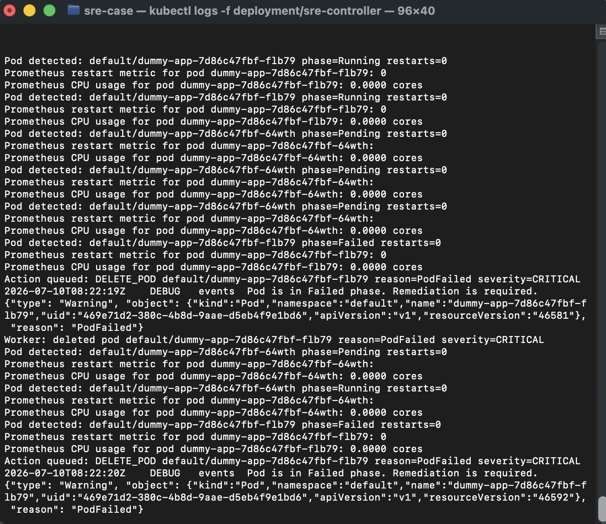
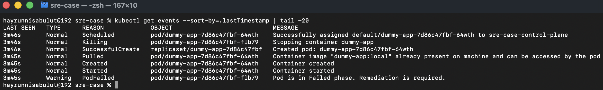
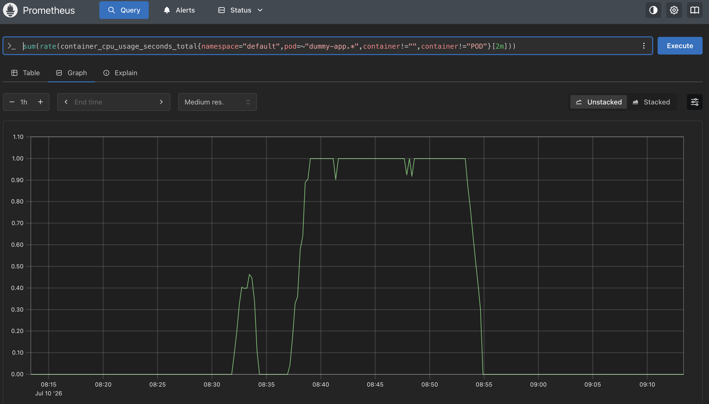
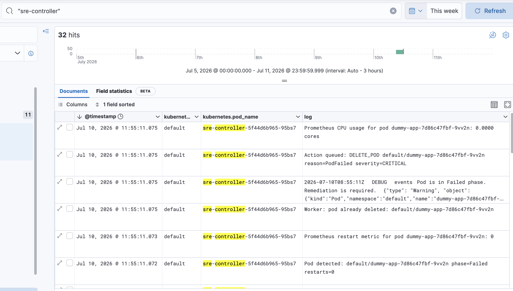
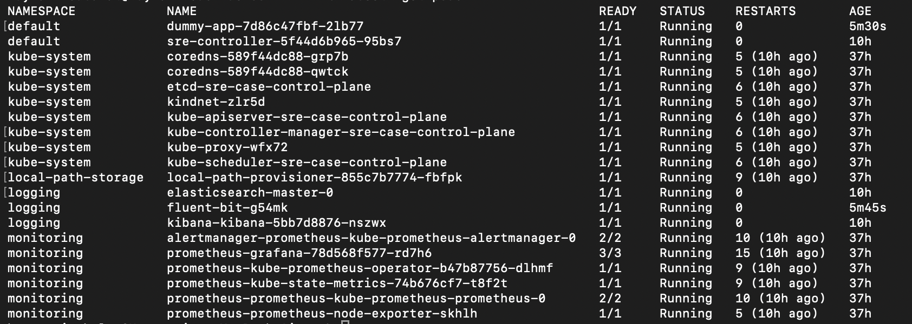

# Kubernetes SRE Self-Healing Controller

An intelligent Kubernetes controller built with Go and controller-runtime that monitors Pod health, analyzes runtime conditions using Prometheus metrics, and performs automated remediation actions through an asynchronous worker.

---

# Features

- Watches Kubernetes Pods
- Monitors only target workloads using labels
- Retrieves CPU usage from Prometheus
- Reads Pod restart counts
- Performs health analysis
- Generates Kubernetes Events
- Queues remediation actions
- Executes asynchronous self-healing
- Sends controller logs to Elasticsearch through Fluent Bit
- Visualizes logs in Kibana

---

# Architecture

```
                   +----------------+
                   | Kubernetes API |
                   +--------+-------+
                            |
                            v
                  +------------------+
                  | Pod Controller   |
                  +------------------+
                            |
                            |
                     Health Analysis
                            |
                            v
                 +---------------------+
                 | Analyzer Component  |
                 +---------------------+
                            |
            +---------------+---------------+
            |                               |
            v                               v
      Kubernetes Event              Remediation Queue
                                            |
                                            v
                                  Remediation Worker
                                            |
                                            v
                                   Kubernetes Client
                                            |
                                            v
                                 Delete / Restart Pod


Prometheus
      |
      v
CPU Usage
Restart Count


Controller Logs
      |
      v
 Fluent Bit
      |
      v
 Elasticsearch
      |
      v
 Kibana
```

---

# Components

| Component | Description |
|-----------|-------------|
| controller-runtime | Kubernetes controller |
| Prometheus | Metrics source |
| Analyzer | Health decision engine |
| Queue | Asynchronous remediation queue |
| Worker | Executes remediation |
| Fluent Bit | Log collector |
| Elasticsearch | Log storage |
| Kibana | Log visualization |

---

# Health Rules

Current analyzer evaluates:

- Pod Failed
- High CPU Usage
- High Restart Count

Example thresholds:

| Metric | Threshold |
|---------|-----------|
| CPU | > 0.05 Core |
| Restart | > Configurable |
| Phase | Failed |

---

# Automated Remediation

Supported actions:

- Generate Kubernetes Event
- Queue remediation action
- Delete unhealthy Pod

---

# Logging Pipeline

```
Controller
    ↓
stdout
    ↓
Fluent Bit
    ↓
Elasticsearch
    ↓
Kibana
```

---

# Technologies

- Go
- controller-runtime
- Kubernetes
- Prometheus
- Docker
- Kind
- Helm
- Elasticsearch
- Kibana
- Fluent Bit

---

# Demo

Start controller

```
go run ./cmd/main.go
```

Create load

```
kubectl exec -it deploy/dummy-app -- sh
yes > /dev/null
```

Delete Pod

```
kubectl delete pod -l app=dummy-app
```

Observe

- Kubernetes Events
- Controller logs
- Elasticsearch
- Kibana

---

## Project Structure

```
apps/
controller-runtime/
deploy/
docs/
scripts/
```

- **apps** → Sample workloads
- **controller-runtime** → Kubernetes controller implementation
- **deploy** → Kubernetes manifests
- **docs** → Architecture & screenshots
- **scripts** → Build and deployment automation

---

## Future Improvements

- Slack Integration
- Microsoft Teams Integration
- Deployment Restart
- StatefulSet Support
- Machine Learning Based Anomaly Detection
- OpenTelemetry
- Grafana Dashboards

---

## Known Limitations

- Only Pod remediation is implemented.
- Thresholds are static and loaded from ConfigMap.
- Slack notifications are mocked.
- Deployment restart action is prepared but not implemented.

---

# Screenshots

## Controller



---

## Kubernetes Events



---

## Prometheus



---

## Kibana



---

## Cluster



Kubernetes
✅ controller-runtime
✅ Pod Watch
✅ Event Watch
✅ Queue mantığı
✅ Worker mantığı
✅ Kubernetes Event oluşturma
✅ Pod silme (Remediation)
Monitoring
✅ Prometheus entegrasyonu
✅ CPU Metric sorgulama
✅ Restart Metric sorgulama
✅ Threshold analizi
✅ ConfigMap üzerinden threshold yönetimi
Logging
✅ Fluent Bit
✅ Elasticsearch
✅ Kibana
✅ Controller loglarının toplanması
DevOps
✅ Dockerfile
✅ Kind Cluster
✅ Deployment manifestleri
✅ RBAC
✅ Scriptler
✅ README
✅ LICENSE
✅ Dokümantasyon klasörü
✅ Screenshot klasörü

# Author

Bilal Demir